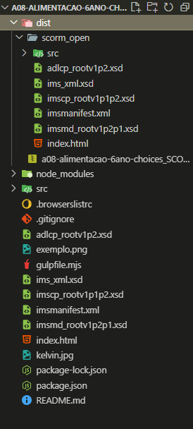

# Projeto de aula SCORM + GDevelop

### 📟 Tecnologias Principais
- Vue CDN

Use os arquivos para desenvolvimento e no final gere a build para fazer upload no LMS.

## ✨ Exemplo

- O ZIP é o pacote SCORM para ser usado no LMS.
- A pasta scorm_open são os arquivos que compõe o pacote SCORM antes do zip.

## 💻 Pré-requisitos

Antes de começar, verifique se você atendeu aos seguintes requisitos:

- Node instalado
- Npm instalado
- Gulp instalado


## 🚀 Instalando na sua máquina

Para instalar, siga estas etapas na raíz do projeto:

```
npm install
```
Obs.: Havendo o arquivo *package.json*, as dependências serão instaladas corretamente deixando o projeto pronto para fazer a build.

## ☕ Gerando Build
Gera o diretório *dist/scorm_open* com os arquivos prontos para se tornarem um pacote SCORM
Na raíz do projeto:

```
gulp etapa-1
```

## Gerando pacote SCORM
*ATENÇÃO!*

Copie o cole a pasta GDevelop para o diretório dist/src, pois não é possível fazer essa cópia automaticamente via gulp.

Compacta todos os arquivos da pasta scorm_open deixando pronto o pacote SCORM.
Execute após copiar e colar a pasta GDevelop como dito acima:

```
gulp etapa-2
```


## 🤝 Qualquer dúvida, entre em contato:

<table>
  <tr>
    <td align="center">
      <a href="https://github.com/oKelvinCosta" title="Kelvin Costa Github">
        <br>
        <sub>
          <b>Kelvin Costa</b>
        </sub>
      </a>
    </td>
  </tr>
</table>

